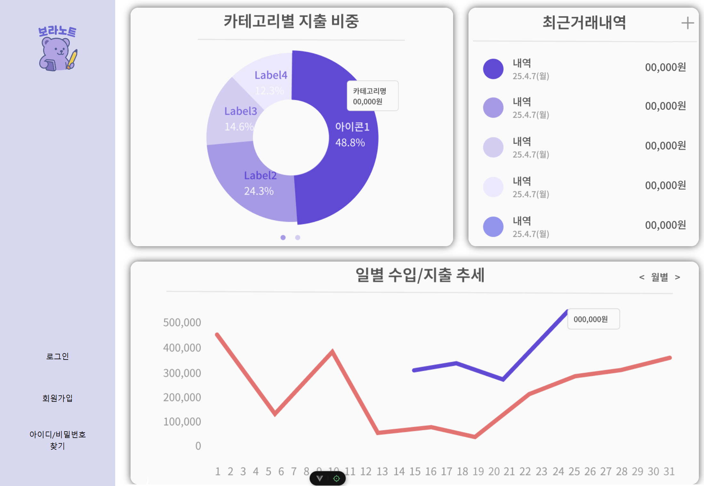
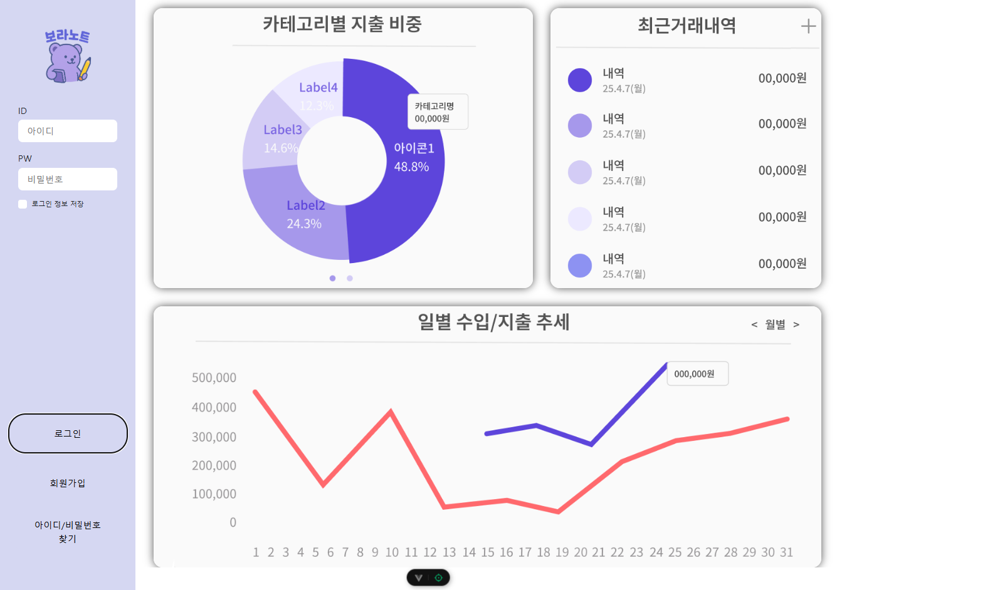
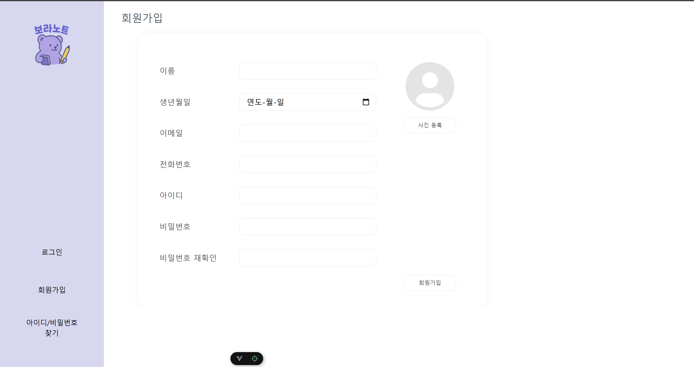
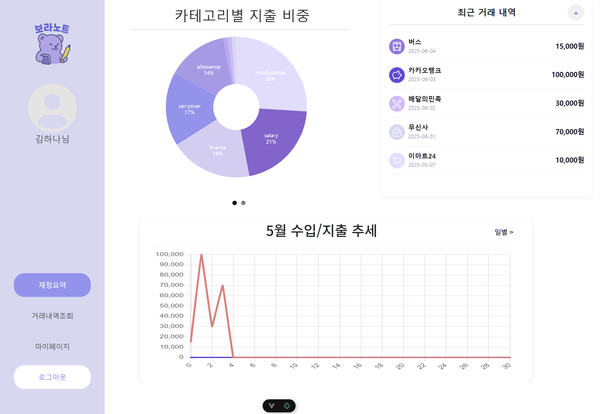
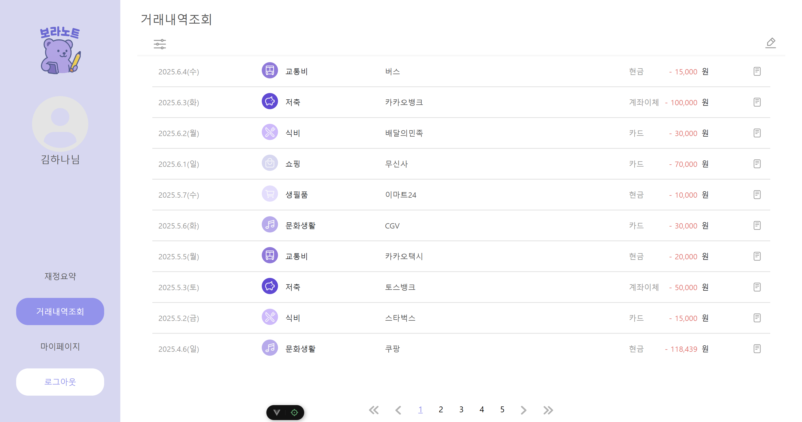
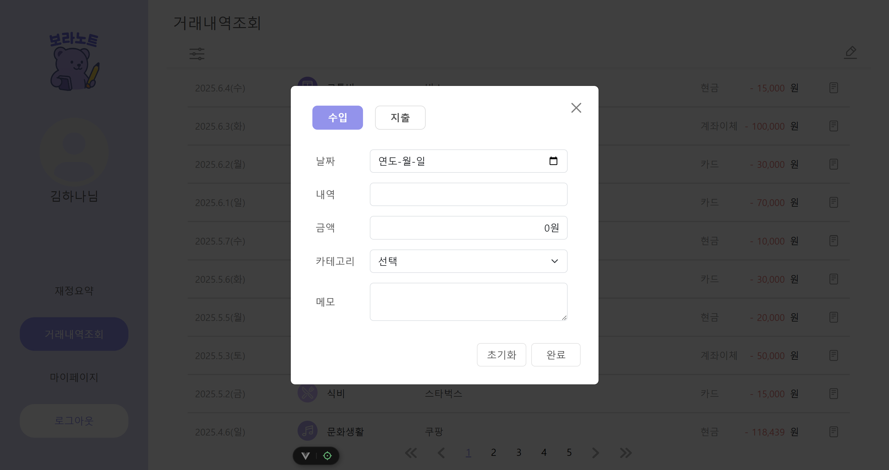
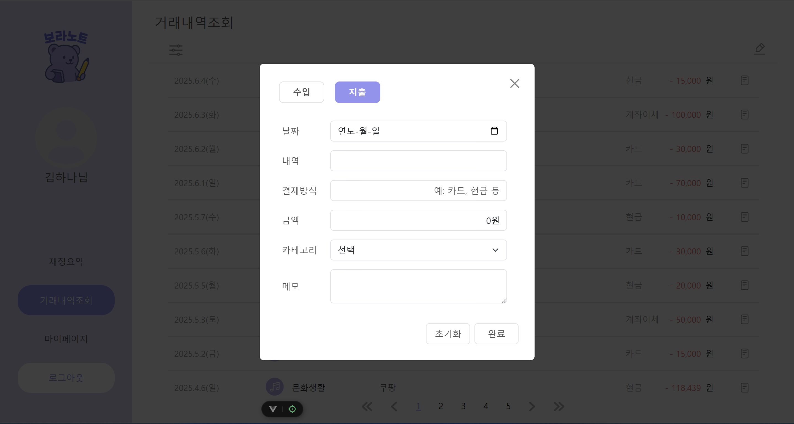
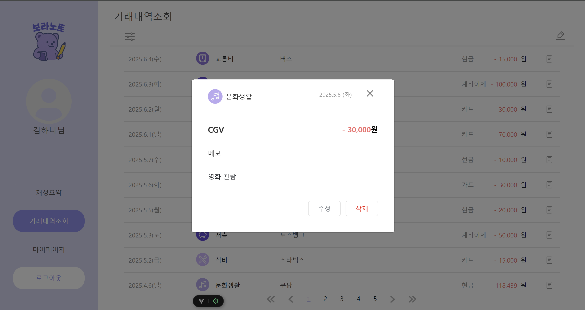
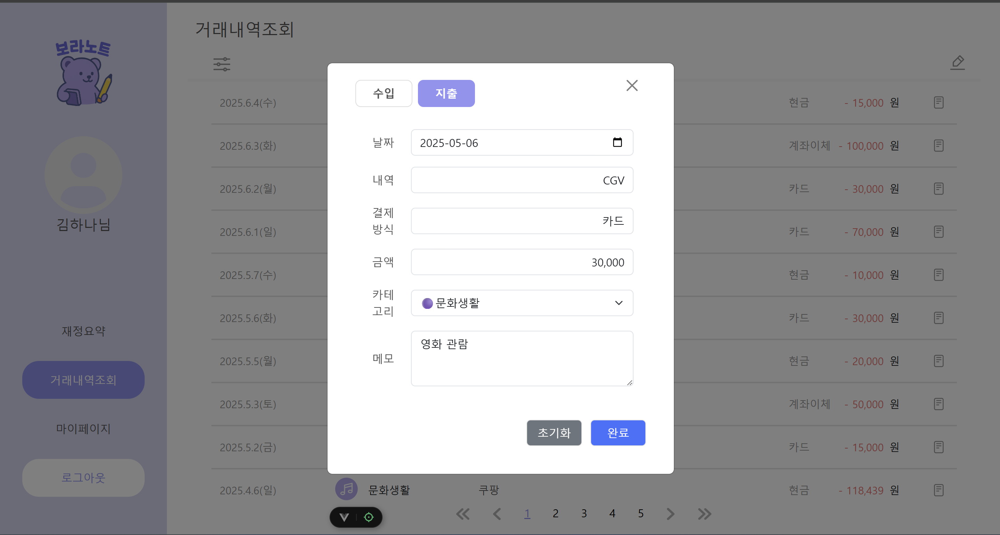
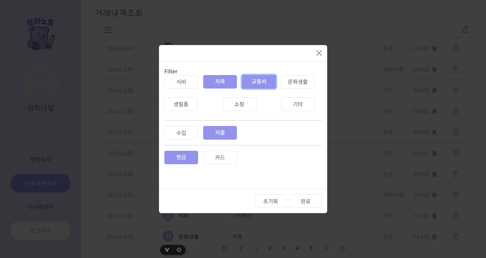

# KB IT’s Your Life 6기 18회차 - 유자팀

# 🟣💸 보라노트(온라인 가계부)💸🟣

재정 관리를 쉽게 도와주는 가계부 플랫폼이에요! 😄
수입과 지출을 한눈에 정리하고, 분석해서 소비 습관도 개선할 수 있도록 만들어졌어요.

이번 달 총 수입과 지출을 확인하고, 과거 데이터를 통해 내 생활 패턴도 돌아볼 수 있어요.
지출은 카테고리별로 분석해서 소비 습관 점검하고, 더 효율적으로 개선할 방법도 찾을 수 있어요.

수입과 지출 내역 등록도 간단하고 직관적이니까 걱정 마세요! ✨

# 👨‍👩‍👦‍👦 팀 소개

| 이은우                                  | 이은미                                  | 이주영                                       |
| --------------------------------------- | --------------------------------------- | -------------------------------------------- |
| [GitHub](https://github.com/EUNWOOLEEE) | [GitHub](https://github.com/minnieming) | [GitHub](https://github.com/LeeJooYoung1999) |

| 맹민재                               | 김준영                                 | 손주성                                   |
| ------------------------------------ | -------------------------------------- | ---------------------------------------- |
| [GitHub](https://github.com/Mminjae) | [GitHub](https://github.com/kjy941211) | [GitHub](https://github.com/ShonJuSeong) |

# 🧩 팀 소개 및 역할

| 이름   | 역할                                         |
| ------ | -------------------------------------------- |
| 이은우 | 카테고리별 지출 그래프, 비로그인 메인 navbar |
| 이은미 | 팀장, 프로젝트 구조 설계                     |
| 이주영 | Figma, 와이어프레임 및 플로우차트            |
| 손주성 | 세부 거래내역 모달, 트랜잭션 필터 기능       |
| 맹민재 | GitHub 세팅, 브랜치 전략, 커밋 컨벤션        |
| 김준영 | 퍼블리싱 (HTML, CSS)                         |
| 노우정 | 퍼블리싱 (HTML, CSS)                         |

# 👨🏼‍🔧기술스택


# 🔧기본 세팅 명령어

### 1. 프로젝트 이동 및 설치

```
cd project/
npm install
```

### 2. JSON Server 실행

```
npx json-server --watch db.json --port 3000
```

### 3. Vue 앱 실행

```
npm run dev
```

### 기본로그인

```
  ID: 1
  PW: 12341234
```

# 🖥️ 화면 별 기능

### [ 로그인 전 ]



### [ 로그인 / 회원가입 ]





### [ 재정 요약 ]


사용자는 이번 달의 총 수입과 지출 합계를 확인할 수 있습니다.
또한 가장 최근 5개월과 이번 달을 비교하는 도표를 통해 자신의 생활 습관을 되돌아볼 수 있고, 바로 직전 달과 이번 달을 비교하여 어느정도의 금액 변동이 생겼는지를 알려줍니다.
마지막 요소로는 이번 달의 내역 상세를 제공합니다. 필터 기능을 통해 전체, 수입, 지출 별로 원하는 내역만 조정하여 볼 수 있습니다.

### [ 거래내역 조회 ]


사용자의 지출 분야를 카테고리별, 소비량순으로 제공해줍니다.
이를 통해 사용자는 본인의 소비습관을 계획하고, 효율적으로 개선할 수 있습니다.
또한 매 주차별 카테고리에 따른 소비량을 제공하여 보다 자세한 소비계획을 만들 수 있도록 돕습니다.
마지막 요소로는 카테고리별 지출 상세 내역을 제공합니다.

### [ 수입 / 지출 / 세부조회 / 수정 / 필터 ]






가계부에 등록할 수입 또는 지출 내역의 세부사항을 등록합니다. 내역명, 변동 금액, 날짜, 거래수단을 카테고리별로 등록할 수 있습니다. 등록된 내역은 날짜별로, 카테고리별로 확인할 수 있습니다.

# 🧑‍💻 Code Convention

📌 Class Name Rule

- BEM 방법론<br/>
  BEM은 Block, Element, Modifier의 약자로, CSS 클래스 네이밍 규칙을 체계적으로 만들기 위한 방법론이에요. 주로 대규모 프로젝트나 협업 시 CSS의 유지보수성을 높이기 위해 사용돼요.

  <br/>

- 케밥 컨벤션

### ✅ 1. 컴포넌트 파일 명명 규칙

- **PascalCase** 사용 (첫 글자 대문자, 단어마다 대문자)
- 예시: `UserProfile.vue`, `SidebarMenu.vue`, `TodoItem.vue`

---

### ✅ 2. 변수 및 함수 명명 규칙 (JavaScript)

- **camelCase** 사용 (첫 단어 소문자, 이후 단어 대문자)
- 예시: `userName`, `getUserInfo()`, `isLoading`

---

### ✅ 3. HTML 코드 작성 규칙

#### 📍 들여쓰기

- `Prettier` 설정 기준 **2칸 들여쓰기**
- 자식 속성은 들여쓰기 적용

```html
<div class="content">
  <div>
    <p class="title">글제목</p>
    <p class="content">상세내용</p>
    <p class="author">작성자</p>
    <p class="date">2025. 04. 05</p>
  </div>
</div>
```

📍 빈 줄 규칙
의미 있는 코드 그룹 사이에는 한 줄 빈 줄 삽입

2줄 이상 금지

📍 id 선택자 사용
레이아웃 용도(wrap, header, container, content, footer, nav, section)에만 id 사용 권장

📍 주석 작성 방식
HTML 주석은 시작/종료 모두 작성

주석은 해당 요소 바로 위/아래 한 줄에 위치

```
<!-- 네임카드 -->
<div class="namecard"> ... </div>
<!-- //네임카드 -->
```

---

### ✅ 4. Vue Template 속성 정렬 순서

Vue 템플릿 속성은 아래 순서대로 정렬합니다:

Global 속성: id

컴포넌트 옵션: is, v-is, :is

기본 디렉티브: v-for, v-if, v-else-if, v-else, v-show, v-cloak, v-once

일반 속성: name, type, src, href, alt, title, value

Props (바인딩 포함): :prop-name="value"

이벤트: @click, @input, @submit, @change 등

양방향 바인딩: v-model

슬롯 관련: v-slot, #default, slot

접근성 관련: role, aria-\*, tabindex

Class & Style: class, :class, style, :style

---

### ✅ 5. CSS 속성 정렬 순서

CSS 속성은 의미 단위로 정렬합니다:

레이아웃 관련

display, visibility, overflow, float, clear, position, top, right, bottom, left, z-index

박스 모델 (BOX)

width, height, margin, padding, border

배경

background

폰트 및 텍스트

font, color, letter-spacing, text-align, text-decoration, text-indent, vertical-align, white-space

기타

위에 포함되지 않은 기타 속성들 (순서 자유)

# ✔️ Git Convention

## (1) Commit Convention

|    Type     | Description                           |
| :---------: | ------------------------------------- |
|   `feat:`   | 새로운 기능 추가                      |
|   `fix:`    | 버그 수정                             |
| `refactor:` | 코드 리팩토링                         |
|   `docs:`   | 문서 작성 및 편집                     |
|  `design:`  | 사용자 UI 디자인 변경 (CSS 등)        |
|   `test:`   | test code, refactoring test code 추가 |

```
ex)

feat: 로그인 기능 구현 (#10)

- 이메일, 비밀번호 입력창 추가
- 입력값 유효성 검사 추가
- 로그인 API 연동
```

## (2) Branch Name Rule

| Branch Name  | Description                           |
| :----------: | ------------------------------------- |
|    `main`    | 배포 가능한 안정된 코드가 있는 브랜치 |
|   `feat/*`   | 새로운 기능 개발 브랜치               |
|   `fix/*`    | 버그 수정 브랜치                      |
| `refactor/*` | 코드 리팩토링 브랜치                  |
|   `docs/*`   | 문서 수정 브랜치                      |
|  `design/*`  | 사용자 UI 디자인 변경(CSS등)          |
|   `test/*`   | test code, refactoring test code      |

### 🔁 브랜치 이름 작성 예시

| 브랜치 이름            | 의미                              |
| ---------------------- | --------------------------------- |
| feature/#21/signup     | 21번 이슈: 회원가입 기능 개발     |
| fix/#34/button-error   | 34번 이슈: 버튼 클릭 시 오류 수정 |
| docs/#45/update-readme | 45번 이슈: README 업데이트        |

# (3) 협업 전략 ( GitHub Flow 전략)

<br/>

## 🔀 GitHub Flow 전략

우리 팀은 **GitHub Flow** 전략을 사용하여 협업을 진행했습니다.  
이는 간단하고 유연한 브랜치 전략으로, **기능 단위의 브랜치 생성**과 **Pull Request 기반 협업**을 핵심으로 합니다.

---

### ✅ GitHub Flow란?

> GitHub Flow는 **main 브랜치를 항상 배포 가능한 상태**로 유지하며, 기능 개발은 별도 브랜치에서 진행한 후 **Pull Request**를 통해 병합하는 방식입니다.

---

### 📌 GitHub Flow 프로세스

<br>

1. **main 브랜치에서 파생된 기능 브랜치 생성**

   ```
   git checkout -b feature/기능이름
   ```

   <br>

2. **기능 개발 및 커밋**

   커밋 메시지는 팀 컨벤션에 맞춰 작성

   feat, fix, style 등의 prefix 사용

   원격 저장소에 브랜치 푸시

   ```
   git push origin feature/기능이름
   ```

   <br>

3. **원격 저장소에 브랜치 푸시**

```
git push origin feature/기능이름
```

<br>

4. **Pull Request 생성**

- GitHub에서 PR 생성

- 팀원들과 코드 리뷰
  <br>

5. **코드 리뷰 및 피드백 반영**

- 변경 사항 논의 후 수정 반영
  <br>

6. **main 브랜치로 병합 (Merge)**

- 리뷰가 완료되면 main 브랜치에 병합

- 병합 후 브랜치 삭제 가능

# 🎨 디자인(피그마)

# 💳 수입 지출 더미 데이터

🔗 [ 더미데이터 링크 ](https://energy-yun.notion.site/33e31704d4e844218cbf75865fae6535?pvs=4)
